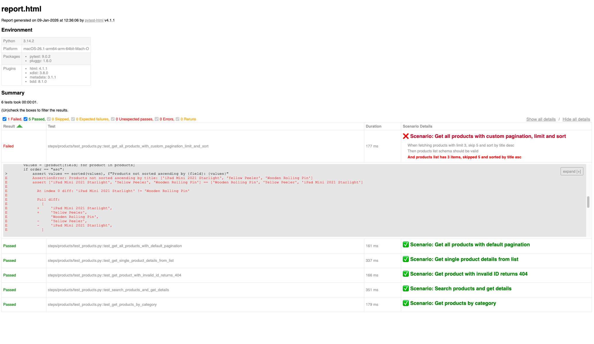

# 🚀 Pytest-BDD API Automation Framework

An API testing framework demonstrating modern test automation practices using pytest-BDD, Python 3.14, and behavior-driven development principles. 
Built to showcase scalable architecture, clean code patterns, and comprehensive API testing capabilities.

## 📋 Table of Contents

- [Overview](#overview)
- [Key Features](#key-features)
- [Architecture](#architecture)
- [Technology Stack](#technology-stack)
- [Project Structure](#project-structure)
- [Setup & Installation](#setup--installation)
- [Environment Configuration](#environment-configuration)
- [Test Execution](#test-execution)
- [Test Coverage](#test-coverage)
- [HTML Reporting](#html-reporting)
- [Design Patterns](#design-patterns)
- [Best Practices Demonstrated](#best-practices-demonstrated)

---

## 🎯 Overview

This framework tests the [DummyJSON API](https://dummyjson.com) using pytest-BDD to demonstrate enterprise-level API testing capabilities. It covers authentication, product management, and cart operations through behavior-driven scenarios written in Gherkin syntax.

**Framework Highlights:**
- ✅ **14+ BDD scenarios** covering authentication, CRUD operations, search, pagination, and error handling
- ✅ **Zero hardcoded IDs** - all test data extracted dynamically from API responses
- ✅ **Environment-aware configuration** supporting production and CI environments
- ✅ **Comprehensive JSON schema validation** for all API responses
- ✅ **Custom HTML reporting** with failure highlighting and fixture tracking
- ✅ **Session management** with automatic retry logic for transient failures

---

## ⭐ Key Features

### Testing Capabilities
- **BDD with Gherkin** - Business-readable test scenarios using Given/When/Then syntax
- **Full CRUD Coverage** - Create, Read, Update, Delete operations for all resources
- **Dynamic Data Extraction** - Products, carts, and users retrieved dynamically (no hardcoded test data)
- **Authentication Integration** - Token-based authentication with session management
- **Negative Testing** - 404 errors, missing credentials, invalid data validation
- **Parametrized Tests** - Data-driven scenarios using Scenario Outlines
- **Schema Validation** - JSON schema validation for every API response

### Framework Architecture
- **Service Layer Pattern** - Clean separation between API endpoints and test logic
- **Fixture-Based Design** - pytest fixtures for setup, teardown, and data sharing
- **Session-Scoped HTTP Client** - Connection pooling and automatic retry for performance
- **Environment Configuration** - Multi-environment support (production/CI) via command-line flags
- **Modular Step Definitions** - Reusable step implementations across features

---

## 🏗️ Architecture
```
┌─────────────────────────────────────────────────────┐
│                 BDD Feature Files                    │
│          (auth.feature, products.feature,            │
│               carts.feature)                         │
└──────────────────┬──────────────────────────────────┘
                   │
                   ▼
┌─────────────────────────────────────────────────────┐
│              Step Definitions Layer                  │
│     (steps.py - Given/When, test_*.py - Then)       │
└──────────────────┬──────────────────────────────────┘
                   │
                   ▼
┌─────────────────────────────────────────────────────┐
│               Services Layer                         │
│  (auth.py, products.py, carts.py - API helpers)     │
└──────────────────┬──────────────────────────────────┘
                   │
                   ▼
┌─────────────────────────────────────────────────────┐
│              HTTP Client Layer                       │
│    (client.py - Session management, retries)        │
└──────────────────┬──────────────────────────────────┘
                   │
                   ▼
┌─────────────────────────────────────────────────────┐
│           DummyJSON REST API                         │
│          (dummyjson.com)                             │
└─────────────────────────────────────────────────────┘
```

### Layer Responsibilities

| Layer | Purpose | Key Files |
|-------|---------|-----------|
| **Features** | Gherkin scenarios defining test cases | `features/*.feature` |
| **Steps** | Step implementations (Given/When/Then) | `steps/*/steps.py`, `steps/*/test_*.py` |
| **Services** | API endpoint helpers with schemas & payloads | `services/*.py` |
| **Support** | HTTP client with retry logic & session mgmt | `support/client.py` |
| **Config** | Environment configuration & user credentials | `config/*.py` |
| **Utilities** | Schema validation & shared helpers | `utilities/*.py` |

---

## 🛠️ Technology Stack

- **Python 3.14** - Latest stable Python release
- **pytest 9.0.2** - Modern testing framework
- **pytest-bdd 8.1.0** - BDD plugin for pytest
- **pytest-html 4.1.1** - Enhanced HTML reporting
- **pytest-xdist 3.8.0** - Parallel test execution
- **requests 2.32.5** - HTTP library with session support
- **jsonschema 4.26.0** - JSON Schema validation
- **python-dotenv 1.2.1** - Environment variable management
- **beautifulsoup4 4.14.3** - HTML report customization

---

## 📁 Project Structure
```
.
├── README.md                      # Project documentation
├── requirements.txt               # Python dependencies
├── pytest.ini                     # Pytest configuration
├── conftest.py                    # Global fixtures & hooks
│
├── _assets/
│   └── readme/
│       └── failed-test-example.png  # HTML report screenshot
│
├── config/                        # Environment & user configuration
│   ├── environment.py             # Multi-environment setup
│   └── users.py                   # Test user credentials
│
├── features/                      # Gherkin BDD scenarios
│   ├── auth.feature               # Authentication tests
│   ├── products.feature           # Product CRUD tests
│   └── carts.feature              # Cart management tests
│
├── services/                      # API endpoint helpers
│   ├── auth.py                    # Auth endpoints & schemas
│   ├── products.py                # Product endpoints & schemas
│   └── carts.py                   # Cart endpoints & schemas
│
├── steps/                         # BDD step definitions
│   ├── auth/
│   │   ├── steps.py               # Given/When steps
│   │   └── test_auth.py           # Then steps with assertions
│   ├── products/
│   │   ├── steps.py
│   │   └── test_products.py
│   └── carts/
│       ├── steps.py
│       └── test_carts.py
│
├── support/                       # HTTP client infrastructure
│   └── client.py                  # Session-based HTTP client
│
├── utilities/                     # Shared utilities
│   └── schema_validation.py      # JSON schema validator
│
└── reports/                       # Test execution reports
    └── report.html                # HTML test report
```

---

## 🚀 Setup & Installation

### Prerequisites
- Python 3.12+ (tested with Python 3.14)
- pip (Python package manager)

### Installation Steps

1. **Clone the repository**
```bash
   git clone <repository-url>
   cd Pytest-BDD-API-Automation
```

2. **Create virtual environment** (recommended)
```bash
   python3 -m venv venv
   source venv/bin/activate  # On Windows: venv\Scripts\activate
```

3. **Install dependencies**
```bash
   pip install -r requirements.txt
```

4. **Configure environment variables**
   
   Create a `.env` file in the project root:

*NOTE:* For security, do not commit the `.env` file to version control. `.env` is already commited, just for demonstration purposes.
```env
   # Production Environment Users
   PROD_EMILY_PASSWORD=emilyspass
   PROD_MICHAEL_PASSWORD=michaelwpass
   PROD_SOPHIA_PASSWORD=sophiabpass

   # CI Environment Users (if different)
   CI_EMILY_PASSWORD=emilyspass
   CI_MICHAEL_PASSWORD=michaelwpass
   CI_SOPHIA_PASSWORD=sophiabpass
```

---

## ⚙️ Environment Configuration

The framework supports multiple test environments through the `--env_prefix` flag:
*NOTES*
* Default is `production` if no prefix provided
* CI/QA environments doesn't really exists, logic implemented only to demonstrate environment switching capability


| Environment | Command | Base URL |
|-------------|---------|----------|
| **Production** (default) | `pytest` | `https://dummyjson.com` |
| **CI/QA** | `pytest --env_prefix=ci` | `https://ci.dummyjson.com` |
| **Custom** | `pytest --env_prefix=qa` | `https://qa.dummyjson.com` |

**Environment Configuration:** `config/environment.py`
- Manages base URLs, headers, and environment detection
- Validates user credentials on startup
- Supports custom environment prefixes

**User Management:** `config/users.py`
- Loads credentials from `.env` file
- Supports separate users for production and CI environments
- Validates password availability before test execution

---

## 🧪 Test Execution

### Run All Tests
```bash
pytest
```

### Run Specific Feature
```bash
pytest -m auth       # Authentication tests only
pytest -m products   # Products tests only
pytest -m carts      # Carts tests only
```

### Generate HTML Report
```bash
pytest --html=reports/report.html --self-contained-html
```

### Parallel Execution
```bash
pytest -n auto  # Uses all available CPU cores
pytest -n 4     # Uses 4 parallel workers
```

### Verbose Output with Logging
```bash
pytest -v -s  # -v verbose, -s shows print statements
```

### Run in CI Environment
```bash
pytest --env_prefix=ci --html=reports/ci-report.html
```

---

## 📊 Test Coverage

### Authentication (`auth.feature`)
- ✅ User authentication with valid credentials
- ✅ Fetching authenticated user profile
- ✅ Authentication error handling (missing password)
- ✅ Authentication error handling (invalid password)

**Total Scenarios:** 4

### Products (`products.feature`)
- ✅ Get all products with default pagination
- ✅ Get products with custom pagination and sorting (parametrized: title asc, price desc)
- ✅ Get single product details from list (dynamic ID extraction)
- ✅ Get product with invalid ID (404 error handling)
- ✅ Search products by query and fetch details
- ✅ Get products filtered by category

**Total Scenarios:** 7 (5 base + 2 parametrized)

### Carts (`carts.feature`)
- ✅ Create cart with authenticated user and product from list
- ✅ Get cart by ID from all carts list
- ✅ Update cart with new product and quantity
- ✅ Delete cart and verify deletion markers

**Total Scenarios:** 4

### Validation Coverage
- **Schema Validation:** All API responses validated against JSON schemas
- **Data Validation:** Business logic verification (positive values, non-empty fields, formats)
- **Error Validation:** 404 responses, 400 bad request, error message content
- **Cross-Entity Validation:** Cart ownership, search result matching, sort order verification

---

## 📈 HTML Reporting

### Customized Reporting Features

The framework includes **custom HTML report enhancements** implemented in `conftest.py`:

#### 1. **Failure Highlighting**
- Failed scenarios display with ❌ red emoji and red scenario name
- Passed scenarios display with ✅ green emoji and green scenario name
- Failed step highlighted in **bold red text**
- All steps listed for failed scenarios for easy debugging

#### 2. **Fixture Data Display**
- All fixtures used in tests printed to report
- Response data formatted as JSON for readability
- Excluded system fixtures (pytestconfig, request, env, client)

#### 3. **Request Logging**
- All HTTP requests logged via `urllib3` at DEBUG level
- Request timeline visible in report logs
- Retry attempts tracked and visible

#### 4. **Visual Example**



**Report shows:**
- Scenario name with status indicator
- All executed steps
- Highlighted failed step
- Complete fixture data used in test
- Full HTTP request/response logs

### Generating Reports
```bash
# Generate self-contained HTML report
pytest --html=reports/report.html --self-contained-html
```

---

## 🎨 Design Patterns

### 1. **Service Layer Pattern**
API endpoints encapsulated in service classes with:
- `ENDPOINT` - API endpoint path
- `SCHEMA` - JSON schema for response validation
- `get_payload()` - Request body builder methods
- `get_params()` - Query parameter builder methods

**Example:** `services/products.py`
```python
class Products:
    ENDPOINT = "/products"
    SCHEMA = {...}
    
    @staticmethod
    def get_params(limit: int = 30, skip: int = 0, sort_by: str = None, order: str = None):
        return {"limit": limit, "skip": skip, "sortBy": sort_by, "order": order}
```

### 2. **Given/When/Then Separation**
- **Given steps** (`steps.py`) - Setup actions, return fixtures
- **When steps** (`steps.py`) - Actions under test, return response fixtures
- **Then steps** (`test_*.py`) - Assertions and validations

### 3. **Dynamic Data Extraction**
No hardcoded IDs - all data extracted from API responses:
```gherkin
When fetching all products
And fetching product at index 0 from list  # Extracts ID dynamically
```

### 4. **Dual-Mode HTTP Client**
HTTP client supports two modes for flexibility:
```python
# Positive tests - auto-assert status and return JSON
response = client.get_request("/products", expected_status=200)

# Negative tests - return raw Response object
response = client.get_request("/products/99999", expected_status=404)
```

### 5. **Session-Scoped Fixtures**
Session-scoped HTTP client for performance:
- Shared connection pool across all tests
- Automatic session cleanup after test suite
- Per-test session reset for isolation

### 6. **Schema-First Validation**
Two-layer validation approach:
1. **Schema validation** - Ensures correct data types and structure
2. **Data validation** - Verifies business logic (positive values, formats, consistency)

---

## ✨ Best Practices Demonstrated

### Code Quality
- ✅ **Type hints** throughout codebase for IDE support
- ✅ **Comprehensive docstrings** for all functions and classes
- ✅ **Explicit naming** - Clear, descriptive variable and function names
- ✅ **DRY principle** - Reusable step definitions and service methods
- ✅ **No magic numbers** - All constants defined in service classes

### Testing Practices
- ✅ **Test isolation** - Each test runs independently with clean state
- ✅ **Fixture-based setup** - No setup/teardown code in tests
- ✅ **Parametrized tests** - Scenario Outlines for data-driven testing
- ✅ **Error handling** - Comprehensive negative test coverage
- ✅ **Assertion messages** - Clear, descriptive failure messages

### Architecture
- ✅ **Separation of concerns** - Layers for features, steps, services, infrastructure
- ✅ **Single responsibility** - Each class has one clear purpose
- ✅ **Dependency injection** - Fixtures injected via pytest
- ✅ **Configuration management** - Environment-specific settings externalized
- ✅ **Retry logic** - Automatic retries for transient failures (502, 503, 504)

### Security
- ✅ **No hardcoded credentials** - All passwords in `.env` file
- ✅ **Gitignore configuration** - `.env` excluded from version control
- ✅ **Environment validation** - Startup check for missing credentials

---

## 📚 Additional Resources

### DummyJSON API Documentation
- **API Base URL:** https://dummyjson.com
- **Documentation:** https://dummyjson.com/docs

### Framework References
- **pytest:** https://docs.pytest.org/
- **pytest-bdd:** https://pytest-bdd.readthedocs.io/
- **requests:** https://requests.readthedocs.io/
- **jsonschema:** https://python-jsonschema.readthedocs.io/

---

## 📝 Notes

- **Mock API Behavior:** DummyJSON is a mock API - POST/PUT/DELETE operations return simulated responses but don't persist data
- **Test Data:** All test data (users, products, carts) comes from DummyJSON's pre-populated database

---


